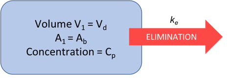
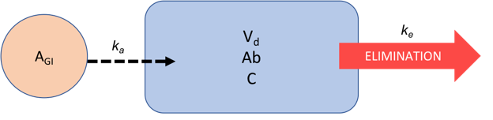
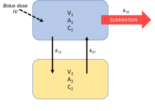
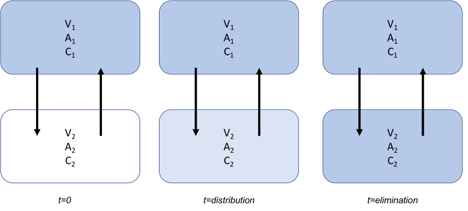

```{r setup, include=FALSE}
knitr::opts_chunk$set(echo = TRUE, fig.pos= "H")
library(tidyverse)
library(kableExtra)
library(gridExtra)

```
\newpage

## Learning outcomes  

* Outline the physiological basis for the one- and two- compartment IV and one-compartment oral-absorption models
* Explain the assumptions that are made when using compartmental models
* Know the equations for the time-concentration relationship for the one-compartment IV bolus model, the one-compartment oral-absorption model and the two-compartment IV bolus model
* Derive the equation for half-life in the one-compartment IV bolus model
* Explain what is meant by a primary pharmacokinetic parameter and a derived or secondary pharmacokinetic parameter
* Explain the relationship between primary pharmacokinetic parameters ($Cl$, $V$, $Q$) and rate constants ($k_e$,$k_{12}$ etc)
* Explain the relationship between distribution rate constants ($k{12}$, $k_{21}$), compartment volumes ($V_n$) and inter-compartmental clearance ($Q$)
* Simulate data using the one compartment IV-bolus and oral-absorption models for multiple participants
* Explain how to simulate using log-normally distributed parameters
* Plot data from simulated experiment
* Undertake non-compartmental analysis on simulated data
* Outline some limitations of compartmental analysis and provide examples where assuming elimination from the central compartment is inappropriate
* Explain how to use the methods described above and apply them to other models, for example the one-compartment IV infusion model

\newpage
# The one-compartment IV bolus model  

## What is the point of a model?
  
It is clear that understanding data from a clinical trial is important. Pharmacokinetic data is the same as any other output from a trial. It is important to understand the data, what it means for the absorption, distribution, metabolism and excretion (ADME) of the compound AND it allows us to make suggestions for the next stage of drug development. This might include dose selection, frequency of administration or even decisions on formulation.  

Compartmental pharmacokinetic models simplify complex human physiology by describing the concentration-time course of a drug with (relatively) simple mathematical equations. These mathematical equations help to quantify ADME processes through the estimation of values for parameters such as clearance and volume of distribution.

## The one-compartment IV bolus model 

In the one compartment model IV bolus model, the body is simplified and represented as a single box, into which the dose of the drug is deposited instantaneously. Drug is assumed to distribute evenly and instantaneously throughout this compartment such that the contents of the box is assumed to be the same wherever you are within it.

```{r onecpt, echo = FALSE, message=FALSE, fig.align='center', fig.cap='One-compartment model',fig.height=3,out.width='0.75\\linewidth'}

```

Figure @ref(fig:onecpt) shows this model. This single compartment is assumed to receive the drug instantly at the time of the intravenous dose. The compartment has a volume $V_1$, which in a one-compartment model is equal to the volume of distribution ($V_d$) of the drug. The concentration in this compartment is equal to the plasma concentration ($C_p$) and the amount of drug in the compartment ($A_1$) is equal to the total amount of drug in the body ($A_b$). Elimination of the drug is usually assumed to be a first-order process with elimination rate constant $k_e$. 

## Relationship between drug amount, concentration, $k_e$, $V_d$ and $Cl$ in the IV bolus model

$k_e, V_1$ and clearance ($Cl$) are related \begin{equation} k_e=\frac{Cl}{V_1} \end{equation}.  

This kind of model can be applied to a drug regardless of whether elimination occurs through hepatic metabolism or renal excretion (or any other means of elimination), provided that the elimination is a first-order process. First-order elimination processes have a rate of elimination that is proportional to the amount of drug that is present. The relationship between drug concentration and elimination rate is\begin{equation} \text{Elimination rate} = Cl\times Cp \end{equation}
and the relationship between elimination rate and amount of drug in the body is \begin{equation} \text{Elimination rate} = k_e\times Ab \end{equation}

## Concentration-time equation for the one-compartment IV bolus model

The concentration $C$ at time $t$ for the one-compartment IV bolus model is \begin{equation} C=C_0e^{-kt} \end{equation} or, if you prefer to use clearance and volume of distribution \begin{equation} C=C_0e^{-\frac{Cl}{Vd}t} \end{equation} $C_0=$ Drug concentration at time $t=0$. 

As an example, the time concentration profile for an intravenous dose of metoprolol is shown in Figure \@ref(fig:metop)
```{r metop, echo=F, fig.cap="Time-concentration profile from the one-compartment IV bolus model of a dose of metoprolol. Standard (left) and log (right) concentration axes shown", fig.width=7,fig.height=3,fig.align = 'center', warning=F,message=F}
k<-0.8*60/(4.2*70)
a<-ggplot(data.frame(x=seq(0,24,1)), aes(x))+
  geom_function(fun=function(x) 20*exp(-k*x))+
  xlab("Time (hours)") + ylab("Metoprolol concentration (microg/L)")+
  theme_bw(base_size=9)+ scale_x_continuous(breaks=seq(0,24,4))

b<-ggplot(data.frame(x=seq(0,24,1)), aes(x))+
  geom_function(fun=function(x) 20*exp(-k*x))+
  xlab("Time (hours)") + ylab("Metoprolol concentration (microg/L)")+
  theme_bw(base_size=9)+ scale_x_continuous(breaks=seq(0,24,4))+
  scale_y_log10() +
  annotate("text", x = 14, y = 4, parse = TRUE,
           label = "Gradient==k[e]",size=3)

grid.arrange(a,b,ncol=2)
```
## Calculating volume of distribution and clearance in the one-compartment IV-bolus model

You may remember that \begin{equation} V_d=\frac{D}{C_0} \end{equation} where $D=$Dose

Clearance may be calculated using $k_e$ and $V_d$.

## Half-life equation

The equation for half-life is also worth refreshing at this point. 
\begin{equation} t_{1/2}=\frac{ln(2)}{k_e}\approx\frac{0.693}{k_e}=\frac{0.693V_d}{Cl} \end{equation}

## Area under the curve

Finally a reminder of the equation for area under the curve \begin{equation} AUC=\frac{Dose}{Cl} (\#eq:auc1)\end{equation}

\newpage

# The one-compartment oral-absorption model

Of course the reality is that most drugs are absorbed through the gastro-intestinal tract. Understanding absorption is therefore a key part of pharmacokinetics. We therefore need to expand on the one-compartment model to take account of this. 

```{r oneor, echo = FALSE, message=FALSE, fig.align='center', fig.cap='One-compartment oral-absorption model',fig.height=3,out.width="100%"}

```

Figure @ref(fig:oneor) provides a schematic of this. Drug in the gastro-intestinal tract is assumed to be absorbed following the same first-order principles that are applied to elimination. $k_a$ is the absorption rate constant, $A_{GI}$ the amount of drug in the gastro-intestinal tract and $$\text{Absorption rate} = k_a\times A_{GI}$$

## Concentration-time equation for the one-compartment oral-absorption model

The concentration for the one-compartment oral-absorption model is \begin{equation} C=\frac{F.D.k_a}{V_d.(k_a-k_e)}.(e^{-k_et}-e^{-k_at}) (\#eq:oneoral)\end{equation}
This is known as a bi-exponential equation, with the absorption exponential term climbing and the elimination exponential term reducing. $D$ is dose and $F$, you will remember, is bioavailability.

As an example, the time concentration profile for an oral dose of metoprolol is shown in Figure @ref(fig:metopor). The dose modelled is the same as in the IV plot shown in Figure @ref(fig:metop) (5 mg).

```{r metopor, echo=F, fig.cap="Time-concentration profile from the one-compartment oral-absorptoin model of an oral dose of metoprolol", fig.width=6,fig.height=2.5,fig.align = 'center', warning=F,message=F}
ke<-0.8*60/(4.2*70) # vd 4.2 L/kg
ka<-3
ggplot(data.frame(x=seq(0,8,1)), aes(x))+
  geom_function(fun=function(x) ((0.5*20*ka)/((ka-ke)*(4.2*70)))*(exp(-ke*x)-exp(-ka*x)))+
  xlab("Time (hours)") + ylab("Metoprolol concentration (microg/L)")+
  theme_bw(base_size=9)+ scale_x_continuous(breaks=seq(0,8,2))+
  scale_y_continuous(labels=function(x)x*1000)

```

## Determining $k_e$ and the elimination half-life in the one-compartment oral absorption model

For the majority of drugs, absorption is faster than elimination (mathematically $k_a$ is greater than $k_e$) and at some time point, all of the drug will have been absorbed (or at least nearly all). In our time-concentration equation this is represented by $e^{(-k_at)}\to0$. 

The period where drug elimination predominates and absorption is zero/negligable is known as the elimination phase where, effectively, Equation \ref{eq:oneoral} is reduced to $$C_{t\to elim}=\frac{F.D.k_a}{V_d.(k_a-k_e)}e^{-k_et}$$
We can plot this on a semi-log scale and, conveniently(!), we achieve a straight line, the gradient of which is $k_e$ and the intercept is $\frac{F.D.k_a}{V_d.(k_a-k_e)}$. Figure @ref(fig:metopor2) shows this relationship. 

It is important to be clear with what we mean by half-life in the context of decreasing plasma concentration following an oral dose of a drug. The correct term to use is actually *elimination half-life*. It refers to the half-life in the elimination phase only and the equation remains the same as with the IV-bolus model (Equation \ref{eq:thalf}) $$t_{1/2}=\frac{ln(2)}{k_e}$$


```{r metopor2, echo=F, fig.cap="One-compartment oral-absorption model of single dose metoprolol on log scale with elimination phase highlighted", fig.width=6,fig.height=2.5,fig.align = 'center', warning=F,message=F}
ke<-0.8*60/(4.2*70)
ka<-3

fun2 <- function(x) ((0.5*20*ka)/((ka-ke)*(4.2*70)))*exp(-ke*x)
dat2 <- data.frame(x = c(seq(0.01,8,1)), y = NA)
dat2$y <- fun2(dat2$x)

ggplot(data.frame(x=seq(0.001,8,0.4)), aes(x))+
  geom_function(fun=function(x) ((0.5*20*ka)/((ka-ke)*(4.2*70)))*(exp(-ke*x)-exp(-ka*x)),col='gray60')+
  geom_line(data=dat2, aes(x,y),col='blue',linetype=2)+
  xlab("Time (hours)") + ylab("Metoprolol concentration \n (microg/L, log scale)")+
  theme_bw(base_size=9)+ scale_x_continuous(breaks=seq(0,8,2))+
  scale_y_log10(labels=function(x)x*1000, breaks=c(0.1,1,10,100)/1000,limits=c(0.05,500)/1000)+
  annotate("text", x = 0.8, y = 0.05+((0.5*20*ka)/((ka-ke)*(4.2*70))), parse = TRUE,
           label = "Intercept==frac((F*.D*.ka),(ka-ke)*Vd)",size=3,col='blue4')+
  annotate("text", x = 3, y = 33/1000, parse = TRUE,
           label = "Gradient==ke",size=3,col='blue4',angle = -3)

```

## Determining $k_a$ and the absorption half-life

Unsurprisingly, we can also associate a half-life with $k_a$. This is known as the absorption half-life and is clinically useful to have a ballpark figure of when absorption will be complete (4-5 half-lives).

Derivation of $k_a$ is slightly more complex than that of $k_e$ but can again be determined by calculating the gradient of a straight line in the log-domain. 

From the section above, we know that the intercept ($I$) of an extrapolation of the elimination phase to time $t=0$ is calculated as $$I= \frac{(F.D.k_a)}{V_d(k_a-k_e)}$$ We can use this term $I$ as we go along to keep things simple meaning that $$C=I(e^{-k_et}-e^{-k_at})$$ From above, in the elmination phase, $$C_{t\to elim}=Ie^{-k_et}$$ If we now calculate $C_{t\to elim}-C$ we get $$C_{t\to elim}-C=Ie^{-k_at}$$
We can again plot this line in the log-form and we are left with a straight line with a gradient of $k_a$. This is shown in Figure @ref(fig:metopor3)

```{r metopor3, echo=F, fig.cap="on-compartment oral-absorption model of single dose metoprolol on log scale with derivation of $k_e$ and $k_a$. The blue dotted line shows $C_{t\\to elim}$ and the red dotted line shows $C_{t\\to elim}-C$.", fig.width=6,fig.height=2.5,fig.align = 'center', warning=F,message=F}
ke<-0.8*60/(4.2*70)
ka<-3

fun2 <- function(x) ((0.5*20*ka)/((ka-ke)*(4.2*70)))*exp(-ke*x)
dat2 <- data.frame(x = c(seq(0.01,8,1)), y = NA)
dat2$y <- fun2(dat2$x)
fun3 <- function(x) ((0.5*20*ka)/((ka-ke)*(4.2*70)))*exp(-ka*x)
dat3 <- data.frame(x = c(0.01,1,1.1,1.2,2), y = NA)
dat3$y <- fun3(dat3$x)

ggplot(data.frame(x=seq(0.001,8,0.4)), aes(x))+
  geom_function(fun=function(x) ((0.5*20*ka)/((ka-ke)*(4.2*70)))*(exp(-ke*x)-exp(-ka*x)),col='gray60')+
  geom_line(data=dat2, aes(x,y),col='blue',linetype=2)+
  geom_line(data=dat3, aes(x,y),col='red',linetype=2)+
  xlab("Time (hours)") + ylab("Metoprolol concentration \n (microg/L, log scale)")+
  theme_bw(base_size=9)+ scale_x_continuous(breaks=seq(0,8,2))+
  scale_y_log10(labels=function(x)x*1000, breaks=c(0.1,1,10,100)/1000,limits=c(0.05,250)/1000)+
  annotate("text", x = 0.8, y = 0.05+((0.5*20*ka)/((ka-ke)*(4.2*70))), parse = TRUE,
           label = "Intercept==frac((F*.D*.ka),(ka-ke)*Vd)",size=3,col='blue4')+
  annotate("text", x = 3, y = 33/1000, parse = TRUE,
           label = "Gradient==ke",size=3,col='blue4',angle = -3)+
  annotate("text", x = 1, y = 3/1000, parse = TRUE,
           label = "Gradient==ka",size=3,col='red4',angle = -45)


```

## Volume of distribution in the one compartment oral-absorption model

It is not possible to identify both bioavailability ($F$) and the volume of distribution ($V_d$) from oral data alone. Knowledge of IV kinetics alongside oral kinetics is needed for this. However, we can calculate the constant $V/F$ (volume relative to bioavailability). You will often see this nomenclature in oral pharmacokinetics papers. 

From the section above, we know that the intercept ($I$) of an extrapolation of the elimination phase to time $t=0$ is calculated as $$I= \frac{(F.D.k_a)}{V_d(k_a-k_e)}$$ We can rearrange this to give \begin{equation} \frac {V_d}{F}= \frac{(D.k_a)}{I(k_a-k_e)} (\#eq:vdf)\end{equation}

## Clearance and AUC in the one compartment oral-absorption model

As with volume of distribution, we cannot tease out bioavailability from clearance. We can calculate $CL/F$. This is referred to as *apparent clearance*. The equation remains similar to Equation \ref{eq:auc1} \begin{equation} \frac{Cl}{F}=\frac{D}{AUC} (\#eq:aucor)\end{equation}

$AUC$ can be estimated using the trapezoid rule, or alternatively it can be calculated using $$AUC=I(\frac{1}{k_e}-\frac{1}{k_a})$$

Alternatively, apparent clearance can be calculated using $k_e$ & $V_d/F$ $$\frac{Cl}{F}=k_e\frac{V_d}{F}$$

\newpage

# The two-compartment IV-bolus model

In the pharmacokinetics course so far, we have spent a long time talking about the fact that drugs will move into some tissues, or across certain epithelial barriers, more easily/faster than others. For example, fat soluble drugs like propofol rapidly enter the central nervous system and then more slowly seep into fatty tissue elsewher. This is, in part, because of the differential blood flow between the  brain (high flow) and fat (lower flow).

Somewhat conveniently (and deliberately), when I have been plotting time-concentration graphs, I have not represented this differential speed of drug movement. This was to help simplify things in the first two years of the course, but now we are moving on with things, it is time to think about this in greater detail. 

The time-concentration profile of a lot of drugs looks a little bit different to the plots in Figure @ref(fig:metop). This happens when a drug rapidly distributes into some tissues (e.g. muscle) and then more slowly distributes into other tissue types (e.g. fat). 


```{r metop2, echo=F, fig.cap="Time-concentration profile of a drug with one-compartment (left) and two-compartment (right) characteristics shown on standard (top) and semi-log (bottom) scales", fig.width=7,fig.height=3.5,fig.align = 'center', warning=F,message=F}
k<-0.8*60/(4.2*70)
a<-ggplot(data.frame(x=seq(0,24,1)), aes(x))+
  geom_function(fun=function(x) 20*exp(-k*x))+
  xlab("Time (hours)") + ylab("Concentration (microg/L)")+
  theme_bw(base_size=9)+ scale_x_continuous(breaks=seq(0,24,4))
a2<-ggplot(data.frame(x=seq(0,24,1)), aes(x))+
  geom_function(fun=function(x) 20*exp(-k*x))+
  xlab("Time (hours)") + ylab("Concentration (microg/L)")+
  scale_y_log10(breaks=c(1,3,10))+
  theme_bw(base_size=9)+ scale_x_continuous(breaks=seq(0,24,4))
A<- 12
B<- 8
alpha<- 2.6
beta<- 0.2
b<-ggplot(data.frame(x=seq(0,24,1)), aes(x))+
  geom_function(fun=function(x) A*exp(-alpha*x)+B*exp(-beta*x))+
  xlab("Time (hours)") + ylab("Concentration (microg/L)")+
  theme_bw(base_size=9)+ scale_x_continuous(breaks=seq(0,24,4)) +
  annotate("text", x = 3.5, y = 12,
           label = "Distribution \n phase",size=3)+
  annotate("text", x = 12, y = 4,
           label = "Elimination phase",size=3)
b2<-ggplot(data.frame(x=seq(0,24,1)), aes(x))+
  geom_function(fun=function(x) A*exp(-alpha*x)+B*exp(-beta*x))+
  xlab("Time (hours)") + ylab("Concentration (microg/L)")+
  scale_y_log10()+
  theme_bw(base_size=9)+ scale_x_continuous(breaks=seq(0,24,4)) 
grid.arrange(a,b,a2,b2,ncol=2)
```

Figure @ref(fig:metop2) shows the two different time-concentration profiles side by side. You can see that the two-compartment profile has a steep distribution phase followed by shallower elimination phase. 


## Concentration-time equation for the two-compartment IV bolus model

The concentration $C$ at time $t$ for the two-compartment IV bolus model is slightly more complex than the one-compartment (Equation \ref{eq:conc}). We now have two exponential curves, reresenting the distribution and the elimination phases. \begin{equation} C=Ae^{-\alpha t}+Be^{-\beta t} (\#eq:twocomp)\end{equation}

When using drug-data, $\alpha$ is conventionally greater than $\beta$ with $Ae^{-\alpha t}$ representing drug distribution and $Be^{-\beta t}$ drug elimination in the majority of cases. 

```{r metop3, echo=F, fig.cap="Two-compartmental pharmacokinetics, with dotted lines indicating parameter derivation (semi-log plot)", fig.width=6,fig.height=2.5,fig.align = 'center', warning=F,message=F}

fun2 <- function(x) B*exp(-beta*x)
dat2 <- data.frame(x = c(0.05, 3), y = NA)
dat2$y <- fun2(dat2$x)
fun1 <- function(x) (A+B)*exp(-alpha*x)
dat1 <- data.frame(x = c(0,0.89), y = NA)
dat1$y <- fun1(dat1$x)

ggplot(data.frame(x=seq(0,24,1)), aes(x))+
  geom_line(data=dat1, aes(x,y),col='red',linetype=2)+  
  geom_line(data=dat2, aes(x,y),col='blue',linetype=2)+
  geom_function(fun=function(x) A*exp(-alpha*x)+B*exp(-beta*x))+
  xlab("Time (hours)") + ylab("Concentration (microg/L)")+
  scale_y_log10(breaks=c(0.1,5,10))+
  annotate("text", x = 1, y = 5.7, parse = TRUE,
           label = "Gradient==beta",size=3,col='blue4',angle = -6)+
  annotate("text", x = 0.5, y = 4, parse = TRUE,
           label = "Gradient==alpha",size=3,col='red4',angle = -54)+
  annotate("text", x = 0, y = B, parse = TRUE,
           label = "Intercept==B",size=3,angle = 90,col='blue4')+
  annotate("text", x = 0.3, y = A+B, parse = TRUE,
           label = "Intercept==A+B",size=3,col='red4')+
  theme_bw(base_size=9)+ scale_x_continuous(limits=c(0,3),breaks=seq(0,4,1))
```

Figure @ref(fig:metop3) maps the parameters for the two compartment model. In a semi-log plot, $\alpha$ is the slope of a straight line parallel to the distribution phase with an intercept $A+B$. $\beta$\ is the slope of the straight line parallel to the elimination phase with intercept $B$. 

## Half-life in the two-compartment model

As we have two exponential decays in the two-compartment model, we actually have two distinct half-lives. The distribution half-life: \begin{equation} t_{1/2,\alpha}=\frac{ln(2)}{\alpha}(\#eq:alphalf)\end{equation}
and the elimination (somtimes referred to as biological) half-life: \begin{equation} t_{1/2,\beta}=\frac{ln(2)}{\beta}(\#eq:bethalf)\end{equation}

Note that $\beta$ is *not* equivalent to $k_e$ (or $k_{10}$, see section below). 

In a clinical setting, the distribution half-life is seldom important. However, the elimination half-life, which can be used to determine the time eliminate a dose, may be important. 

In a clinical trial, distribution half-life may be important to know in determining timing of pharmacokinetic samples. 

## AUC and clearance

The equation relating $AUC$ and $Cl$ remain the same and are related to $A,B,\alpha$ and $\beta$ as follows  $$AUC = \frac{Dose}{Cl} = \frac{A}{\alpha}+\frac{B}{\beta}$$ 


## Graphical representation of the two-compartment model
```{r twocpt, echo = FALSE, message=FALSE, fig.align='center', fig.cap='Two-compartment model', out.height="25%"}

```

The two compartment model is graphically represented in Figure @ref(fig:twocpt). You can see that, mathematically, things are a little more complex, with three equilibrium constants. $k_e$ is now replaced by $k_{10}$ to represent constant associated with elimination from the central compartment (compartment 1 to out, 0). The second compartment has a rate associated with drug moving into it from the central compartment ($k_{12}$) and out of it ($k_{21}$), back to the central compartment. It is worth noting that in this model, elimination *only* occurs from the central compartment. For most drugs, where metabolism and excretion is hepatic/renal this is reasonable, as compartment 1 is usually modelled as the plasma, and of course this flows through the eliminating organs. However, some drugs undergo degradation that is independent of these organs. For example, the muscle relaxant atracurium undergoes spontaneous degradation and ester hydrolysis. These processes can occur in any tissue. For drugs like this, modelling elimination from the central compartment only may not describe time-concentration data accurately. Thankfully, this is the exception, rather than the norm.


```{r twotime, echo = FALSE, message=FALSE, fig.align='center', fig.cap='Representation of time ($t$)-course of two-compartment model. At the time of the dose ($t=0$), all drug is deposited in the central compartment. In the distribution phase, it begins to move into the second (peripheral) compartment, with the amount in each compartment reaching equilibrium in the elimination phase.  Note that this is a simplification as elimination from the central compartment would be happening concurrently', out.width='0.75\\linewidth'}

```

Figure @ref(fig:twotime) illustrates the dose deposition in the central compartment after which it is distributed into the peripheral (second) compartment, reaching equilibrium with the central compartment at the end of the distribution phase. Note that this figure simplifies the situation; elimination would be occurring concurrently.

## Volume of distribution in the two-compartment model

Remember, the apparent volume of distribution is the theoretical volume of fluid required to dilute the amount of drug present in the body to achieve the same concentration as that measured in the plasma. 

In the two compartment model, there are two volume terms $V_1$ and $V_2$. As you can see from Figure @ref(fig:twotime), at time $t=0$ all of the drug present in the body is in the central compartment (the dose which has been injected into compartment 1). At any single time point in the elimination phase, drug is distributed evenly between compartment 1 and compartment 2. $V_d$ is therefore different depending on the time since treatment started. 

At time $t=0$ \begin{equation} V_d =V_1 = \frac{Dose}{C_0} =\frac{Dose}{A+B} (\#eq:vd1)\end{equation}

The $V_d$ in the distribution phase is complex and challenging to calculate because drug elimination is constantly occurring. At steady-state, when drug input $=$ drug elimination the volume of distribution $Vd_{ss}$ is \begin{equation} Vd_{ss} =V_1+V_2 (\#eq:vdss)\end{equation}

## Inter-compartmental clearance ($Q$)

Pharmacometricians, like many scientists, don't all do things in exactly the same way. Sometimes, in compartmental modelling, you will see reference to inter-compartmental clearance ($Q$). This parameter replaces $k_{12}$ and $k_{21}$. Perhaps you can see the appeal of having one parameter instead of two to describe the two-compartment model. You might actually find this way of parameterising a compartmental model more intuitive, since it is akin to the clearance we associate with elimination. \begin{equation} k_{12}V_1 =Q = k_{21}V_2 (\#eq:Q)\end{equation}

This relationship is worth remembering. 


### Linking $\alpha$, $\beta$, $A$ and $B$ with $k_{10}$, $k_{12}$ and $k_{21}$
The relationships between $\alpha$ and $\beta$ with $k_{10}$, $k_{12}$ and $k_{21}$ are listed below. It is, in my view, utterly pointless to learn these equations, but you might find use for them at some point.
$$ \alpha + \beta = k_{10}+k_{12}+k_{21}$$  $$ \alpha . \beta = k_{10}.k_{21}$$ $$A = \frac{D(\alpha-k_{21})}{V_1(\alpha-\beta)}$$ $$B = \frac{D(k_{21}-\beta)}{V_1(\alpha-\beta)}$$ 

Explicit equations for each individual parameter are also available. I'll leave it to you and Google to source these if you want them. 

# Primary versus secondary pharmacokinetic parameters and model parameterisation

You will have noticed in the session we have talked interchangeably between the familiar terms clearance and volume of distribution and rate constants, like $k_e$ and their relationships with each other. 

You may see some texts refer to 'primary' and 'secondary' pharmacokinetic parameters. 

Primary pharmacokinetic parameters are dependent upon human physiology and drug physiochemical properties. It is hopefully, therefore, intuitive to go on to state that $V_d$ and $Cl$ are primary pharmacokinetic parameters. By extension, intercompartmental clearance, $Q$, is also a primary pharmacokinetic parameter. 

Secondary pharmacokinetic parameters are derived from primary pharmacokinetic parameters. $t_{1/2}$, $k_e$, $k_{12}$ and $k_{21}$ can all be derived from $Cl$, $V_n$ and $Q$, using the equations we have been through today. $AUC$ can be derived from $Cl$ and $Dose$. $A$, $B$, $alpha$ and $beta$ can be similarly derived. 

Similarly, in pharmacokinetic modelling, you will note that modellers may choose to 'parameterise' (define) their model in terms of primary pharmacokinetic parameters or secondary pharmacokinetic paramters. Table \@ref(tab:params) compares these different parameterisation methods.   

```{r params, echo = FALSE, message=FALSE}

Model<-c("One-compartment","Two-compartment")
Rate_constants<-c("ke and Vd","k10, k12, k21, V1 and V2")
Primary_parameters<-c("Cl and Vd", "Cl, Q, V1 and V2")
Hybrid_constants<-c("", 'A, B, alpha, beta')
models<-data.frame(Model, Primary_parameters,Rate_constants,as.character(Hybrid_constants))


models%>%
    kbl(booktabs = TRUE, caption = "Comparison of model parameterisation methods for one and two compartment models",
        col.names = c("Model","Primary PK parameters","Rate constants", "Hybrid constants")) %>% 
  kable_styling() %>%
  add_header_above(c(" ", "Parameterisation" = 3),bold=TRUE)%>% row_spec(0,bold=TRUE) 

```

