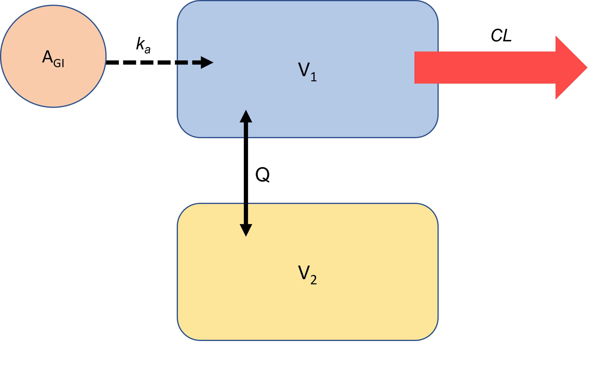

```{r setup, include=FALSE}
knitr::opts_chunk$set(echo = TRUE, fig.pos= "H")
library(tidyverse)
library(kableExtra)
library(gridExtra)
library(RColorBrewer)
library(nlmixr2)
```

# Introduction 

In this chapter, we will start to answer the questions:

\begin{center} \textit{How do I know if my model is any good?} \end{center}
and
\begin{center} \textit{How do I know if one model is better than another?} \end{center}

We will start to explore the output from an \texttt{nlmixr2} model fit and think about the idea of model diagnostics, which may be numerical, graphical or even simulation based. We will start with thinking about the straightforward linear-regression model and then move on to modelling some pharmacokinetic data. 

## Learning outcomes  


* With the example of the linear-regression model, use model diagnostics to evaluate the model fit and assess whether the assumptions made when applying a linear regression model are reasonable
* Describe some standard diagnostic plots for a non-linear mixed-effects model
  + DV vs PRED/IPRED, CWRES vs TAD
* Explain how weighted residuals can be used to develop a model
  + For example how a u-shaped distribution may indicate need for an additional compartment
* Explain how to code a two-compartment oral-absorption model using \texttt{nlmixr2}
* Describe how to use diagnostic plots to evaluate model fit and choose a superior model
  + Use a comparison of one- and two-compartment model for this
* Explain how the objective function value may be useful in quantitative evaluation of model fit
  + Define the Akaike Information Criteria ($AIC$) and describe how it may be used to select a superior model


# Introduction to model diagnostics using linear regression as an example

You should be conscious that the vast majority of modelling processes require some assumptions to be made. This is as true for the simple t-test as it is for non-linear mixed-effects models. What *I don't think* you have thought about much on this course is how to assess whether making these assumptions was the right call for your data. 

You will hopefully be aware that linear-regression modelling requires four assumptions to be met:

* There is a linear relationship between the outcome and predictor variables 
  + *Hopefully this doesn't come as a shock!*
* The variance of residuals is the same for any value of the predictor variable (**this is known as homoscedasticity**)
* There is **independence** between observations
* Residuals at any predictor value are normally distributed (**normality**)

Let's think about how we assess whether this is true or not *after* we have undertaken linear regression modelling. 

## Back to the carrots!

Let's look at this with our carrot data. You will recall that we looked at the residuals by plotting them (Figure \@ref(fig:lm)). 


```{r,echo = FALSE,eval=TRUE, message=FALSE}
carrot<-read_csv("https://raw.githubusercontent.com/dlonsdal/SGUL_PK_data/main/carrot_data.csv")

```


```{r lm,echo = F,eval=T, fig.cap="Carrot data with linear regression line and residual error (dotted red lines)",fig.width=7,fig.height=3,fig.align='center',message=FALSE}
fit<-lm(weight~length,data=carrot)
fit$stdres<-rstandard(fit) #kept but we dont actually use


ci<-predict(fit, interval='confidence') # create table with the 95% confidence intervals 
carrot<-cbind(carrot,ci) # combine this with our original data

ggplot(data=carrot, aes(x=length, y=weight))+
  geom_point(size=2)+ 
  geom_segment(aes(x=length,xend=length,y=weight,yend=fit),col='red', linetype='dotdash')+
  geom_line(aes(y=fit), col='blue')+
  xlab("Length (cm)")+ylab("Weight (g)")+
  theme_bw(base_size=9)

```

We can extend this process and plot several diagnostic plots from using the residuals and ouput form the linear regression. Rather than complex \texttt{ggplot2} code, I'm opting to use \texttt{base R} with \texttt{plot(fit, which = 1:2)}. You can see the output from this in Figure \@ref(fig:resid).

### Checking linearity and homoscedasticity 

Figure \@ref(fig:resid)(a) shows the plot of fitted values vs residuals. Here, you can see that the residuals are spread evenly between positive and negative values and that this pattern is repeated along all observed values of carrot length (our predictor variable). If there was no linearity, we would expect some unusually large values on this plot. If there was no homoscedasticity, the spread of the data would change (larger values for certain values of carrot weight). 

### Checking normality
For this, we use something called a Normal Q-Q plot. Figure \@ref(fig:resid)(b) shows this. I'm not going to spend long focusing on this, suffice to say that data meeting the normality assumption should have observations that run along the line of unity ($y=x$), which they do here.   

```{r resid,echo = TRUE,fig.cap='linear regression model diagnostics for carrot data', fig.subcap=c('',''),fig.ncol = 2, out.width = "50%",eval=TRUE, message=FALSE}

carrot<-
  read_csv("https://raw.githubusercontent.com/dlonsdal/SGUL_PK_data/main/carrot_data.csv")
fit<-lm(weight~length,data=carrot)
plot(fit, which=1:2)
```

## Task 1

* Download the aubergine dataset from GitHub

Run \texttt{read\_csv("https://raw.githubusercontent.com/dlonsdal/SGUL\_PK\_data/main/aubergine.csv")}

* Fit a linear model to it
  + Have a look at the associated p-value using \texttt{summary(modelfit)}
* Plot the diagnostic plots
  + Note what you think may be wrong
* Then plot aubergine weight vs length
  + Does this explain the errors you found?
  

## Task 1 solution 

```{r,eval=F}

aubergine<-
  read_csv("https://raw.githubusercontent.com/dlonsdal/SGUL_PK_data/main/aubergine.csv")
```
```{r,echo=F,message=F,warning=FALSE, results='hide'}
aubergine<-read_csv("https://raw.githubusercontent.com/dlonsdal/SGUL_PK_data/main/aubergine.csv")
```
```{r}
fit<-lm(weight~length,data=aubergine)
summary(fit)
```

You can see that if you looked just at the p-value you might consider there to be a strong, linear relationship and that linear modelling was appropriate. Now look at the diagnostic plots. 

```{r aubresid,echo = TRUE,fig.cap='linear regression model diagnostics for aubergine data', fig.subcap=c('',''),fig.ncol = 2, out.width = "50%",eval=TRUE, message=FALSE}
plot(fit, which=1:2)
```
You can see from Figure \@ref(fig:aubresid) that almost none of the assumptions hold in the modelling of these data. You can see why in the plot of aubergine length versus weight (Figure \@ref(fig:aublm)). The relationship between the variables is not linear!  

```{r aublm,echo = F,eval=T, fig.cap="Aubergine data with linear regression line and residual error (dotted red lines)",fig.width=7,fig.height=3,fig.align='center',message=FALSE}


ci<-predict(fit, interval='confidence') # create table with the 95% confidence intervals 
aubergine<-cbind(aubergine,ci) # combine this with our original data

ggplot(data=aubergine, aes(x=length, y=weight))+
  geom_point(size=2)+ 
  geom_segment(aes(x=length,xend=length,y=weight,yend=fit),col='red', linetype='dotdash')+
  geom_line(aes(y=fit), col='blue')+
  xlab("Length (cm)")+ylab("Weight (g)")+
  theme_bw(base_size=9)

```

This is a slightly artificial scenario to demonstrate how graphical diagnostics can help to tell you that there is a problem with your model. In reality here, if we had done our job properly and plotted the data *first* we would have seen that the relationship does not look linear. 

Now, back to PK models...........

# Introduction to diagnostic plots for non-linear mixed-effects pharmacokinetic models

There are a wealth of diagnostic plots that can be used to think about how well a model fits data from an experiment. We will look at a few key examples.

## DV vs PRED and DV vs IPRED

The most straightforward diagnostic plot available is a plot of observations (dependent variable, DV) vs predicted concentrations from a model. There are two subsets of this type of plot. The first, DV vs PRED takes predictions based on population parameters (i.e. excluding $\eta$'s) and the second is DV vs IPRED, which bases predictions on individual values for model parameters (including $\eta$'s).

Figure \@ref(fig:frufit) shows these diagnostic plots for the furosemide data we modeled last week. If you haven't saved your model fit, you can download mine from Github.


```{r frufit,echo=T,eval=T,fig.cap="Basic diagnostic plots for furosemide one-compartment, oral-absorption model fit from Chapter 4", fig.subcap=c('DV vs PRED','DV vs IPRED'),fig.ncol = 2, out.width = "50%", fig.align = 'center', warning=F,message=F}

link <- "https://github.com/dlonsdal/SGUL_PK_data/blob/main/frufit.rds?raw=true"
fru.fit <- readRDS(url(link, method="libcurl"))
modfit<-data.frame(fru.fit)
ggplot(modfit,aes(x=PRED,y=DV))+
  geom_point()+
  theme_bw(base_size=18)+
  geom_abline(intercept = 0, slope=1)+
  geom_smooth(col='red',se=F)+
  xlim(0,1.25)+ylim(0,1.25)
ggplot(modfit,aes(x=IPRED,y=DV))+
  geom_point()+
  theme_bw(base_size=18)+
  geom_abline(intercept = 0, slope=1)+
  geom_smooth(col='red',se=F)+
  xlim(0,1.25)+ylim(0,1.25)

```


Take a look at Figure \@ref(fig:frufit)(a) first. A *perfect* model fit would have predictions that were identical to the observations from the experiment. All of the points in the scatterplot would fall in a straight line along the line of unity ($DV=PRED$). However, as we have discussed previously, *real-world* data is never perfect, individuals have PK parameters that deviate from the population mean values and there will be un-modelled error. So, what we are really looking for in this plot is a degree of even spread of points above and below the line of unity. Any groups of data points deviating away from this line of unity might make us suspicious that there is some underlying variability not being modelled. 

In our example in Figure \@ref(fig:frufit)(a) we can see that there is pretty reasonable fit, with even distribution of data points. A red 'line of best fit' tracks fairly evenly along the line of unity. This suggests our model fit is pretty good. 

Figure \@ref(fig:frufit)(b) shows DV vs IPRED This is individualised predictions, taking into account that random-effect associated with an individual ($\eta). Again, the perfect model fit has all lines along the line of unity. DV vs IPRED plots will generally always look a little better than DV vs PRED plots in this regard. However, it is unusual to get such a tight fit as we see in Figure \@ref(fig:frufit)(b) as usually there is additional unexplained variability in data. The example here looks relatively perfect because I simulated these data and I did not simulate complex variability!


## Task 2
For this task we will be using some simulated data. In this simulated experiment, 20 participants were given 1000 mg oral dose of Drug X. Seven pharmacokinetic samples were taken in the subsequent hours. 

* Download simulated data 

Run \texttt{read\_csv("https://raw.githubusercontent.com/dlonsdal/SGUL\_PK\_data/main/drugxsim.csv")}

* Plot the data
  + Note any thoughts you have about a likely PK model
* Fit a one-compartment oral-absorption model using \texttt{nlmixr2}
* Create DV vs PRED diagnostic plot
  + Note any thoughts about the model fit
  
To help you with this task, you may find the following code helpful. **Note:** The model is sensitive to initial parameter estimates. Trial the ones below and compare the output to other initial parameter estimates (ini block).


```{r, eval=F,cache=F,message=F,warning=F}
drugxsim<-
  read_csv("https://raw.githubusercontent.com/dlonsdal/SGUL_PK_data/main/drugxsim.csv")
library(nlmixr2)
one.cmt <- function() {
  ini({ 
    tka <-log(0.5) 
    tcl <- log(8) 
    tv <- log(20)
    eta.ka~0.01
    eta.cl ~ 0.1
    eta.v ~ 0.1
    add.sd <- 0.01
  })
  model({
    ka <- exp(tka + eta.ka)
    cl <- exp(tcl + eta.cl)
    v <- exp(tv + eta.v)
    linCmt() ~ add(add.sd)
  })
}
nlmixr2(one.cmt)
drugxfit<-nlmixr2(one.cmt,drugxsim,est="saem", list(print=0))

modfit<-data.frame(drugxfit)

ggplot(modfit,aes(x=PRED,y=DV))+
  geom_point()+
  theme_bw(base_size=18)+
  geom_abline(intercept = 0, slope=1)+
  geom_smooth(col='red',se=F)+xlim(0,10)+ylim(0,10)
```

## Task 2 solution

```{r drugxone,cache=FALSE,echo=F,eval=T,fig.cap="Basic diagnostic plots for drug X one-compartment, oral-absorption model fit", fig.subcap=c('Concentration-time plot','Semi-log concentration-time plot','DV vs PRED','DV vs IPRED'),fig.ncol = 2, out.width = "50%", fig.align = 'center', warning=F,message=F}

drugxsim<-read_csv("https://raw.githubusercontent.com/dlonsdal/SGUL_PK_data/main/drugxsim.csv")
drugxsim$ID<-as.factor(drugxsim$ID)
ggplot(subset(drugxsim,EVID==0),aes(x=TIME,y=DV,group=ID,col=ID))+
  geom_line(alpha=0.2,col='grey')+
  geom_point()+
  theme_bw(base_size=18)+
  theme(legend.position="none")+
  ylab("Plasma concentration mg/L")+
  xlab("Time (hr)")

ggplot(subset(drugxsim,EVID==0),aes(x=TIME,y=DV,group=ID,col=ID))+
  geom_line(alpha=0.2,col='grey')+
  geom_point()+
  theme_bw(base_size=18)+
  theme(legend.position="none")+
  ylab("Plasma concentration mg/L")+
  xlab("Time (hr)")+
  scale_y_continuous(trans='log2', breaks=c(0.001,0.1, 2))


library(nlmixr2)
one.cmt <- function() {
  ini({ 
    tka <-log(0.5) 
    tcl <- log(8) 
    tv <- log(20)
    eta.ka~0.1
    eta.cl ~ 0.1
    eta.v ~ 0.1
    add.sd <- 0.01
  })
  model({
    ka <- exp(tka + eta.ka)
    cl <- exp(tcl + eta.cl)
    v <- exp(tv + eta.v)
    linCmt() ~ add(add.sd)
  })
}
drugxfit<-nlmixr2(one.cmt,drugxsim,est="saem", list(print=0))

modfit<-data.frame(drugxfit)

ggplot(modfit,aes(x=PRED,y=DV))+
  geom_point()+
  theme_bw(base_size=18)+
  geom_abline(intercept = 0, slope=1)+
  geom_smooth(col='red',se=F)+xlim(0,10)+ylim(0,10)
ggplot(modfit,aes(x=IPRED,y=DV))+
  geom_point()+
  theme_bw(base_size=18)+
  geom_abline(intercept = 0, slope=1)+
  geom_smooth(col='red',se=F)+xlim(0,10)+ylim(0,10)
```

Figure \@ref(fig:drugxone) shows a quite inconsistent fit over the range of observed concentrations, with the model seeming to under-predict at low concentrations and over-predict at high concentrations. Let's have a look at another diagnostic plot to help us with thinking about this problem.

## Conditionally-weighted residuals
We can look at the idea of residuals from our non-linear mixed-effects models in the same way as we did with our linear models. We can look to see that our residuals remain even across the range of sampling times and observed concentrations.

We are going to introduce a further step, normalising the residuals through a weighting step. This is important because residuals might be influenced by the magnitude of the observation (e.g. you might find a greater range of residuals around $C_{max}$ compared to around $C_{min}$). Weighting the residuals in order to standardise them makes it easier to think about what is happening with model predictions across the full range of observations. We will use conditionally weighted residuals (\texttt{CWRES}), which are a fairly standard form of residual. You don't need to know exactly how these are created, unless you decide to pursue modelling as a career of course...... 

Additionally, this leads to a situation where the conditionally weighted residuals (\texttt{CWRES}) should follow an approximately normal distribution with mean zero and variance 1.$$CWRES\sim N(0,1)$$ This is helpful because we can expect 99.7% of data points to fall within $+/- 3$. We can look for trends in this kind of plot to help with our model building process. 

\texttt{nlmixr2} will output \texttt{CWRES} through an additional \texttt{tableControl()} command.

```{r, cache=F,warning=FALSE,message=FALSE, results='hide'}

drugxfit<-nlmixr2(one.cmt,drugxsim,est="saem",
       list(print=0),
       table = tableControl(cwres = TRUE))

modfit<-data.frame(drugxfit)

```
```{r cwres,echo=T,eval=T,fig.cap="Conditionally weighted residuals plotted against time from dose",fig.width=6,fig.height=3,fig.align = 'center',warning=FALSE,message=FALSE}
ggplot(modfit,aes(x=tad,y=CWRES))+
  geom_point()+
  theme_bw(base_size=9)+
  xlab('Time after dose (h)')+
  geom_abline(intercept = 0, slope=0)+
  geom_smooth(col='red',se=F)+
  ylim(-3,3)
```
You can see from Figure \@ref(fig:cwres) that we are lacking in a uniform distribution of \texttt{CWRES} across sampling times. In fact, this U-shape that is seen in the \texttt{CWRES} plot can be indicative of the need for an additional compartment in the model. Perhpas you might have thought this when looking at the raw data plot. 

## Task 3

```{r twocpt, echo = FALSE, message=FALSE, fig.align='center', fig.cap='Two-compartment oral-absorption model',out.width="60%"}

```

* Fit a 2-compartment oral-absorption model to the Drug X data
* Plot the standard diagnostic plots described above
 + Do you think there is evidence of improved model fit?
* Have a look at \texttt{drugxfit\$OBJF} for the one- and two- compartment model fit
 + What do you notice about this numerical value

You will need to write a function for a two-compartment oral-absorption model. Have a look at Figure \@ref(fig:twocpt) and see if you can work out what to change from your one compartment model. Failing that, go for \texttt{Google}!


## Task 3 solution

Again, note that the model is sensitive to initial parameter estimates. Trial the ones below and compare the output to other initial parameter estimates (ini block).
```{r warning=FALSE,cache=F, message=FALSE, results='hide'}

two.cmt <- function() {
  ini({ 
    tka <-log(0.5) 
    tcl <- log(8)
    tq<- log(15)
    tv2 <- log(10)
    tv3 <- log(50)
    eta.ka ~ 0.1
    eta.cl ~ 0.1
    eta.v ~ 0.1
    add.sd <- 0.1
  })
  model({
    ka <- exp(tka+eta.ka)
    cl <- exp(tcl + eta.cl)
    v2 <- exp(tv2 + eta.v)
    v3<- exp(tv3)
    q<- exp(tq)
    linCmt() ~ add(add.sd)
  })
}
drugxfit2<-nlmixr2(two.cmt,drugxsim,est="saem",
       list(print=0),
       table = tableControl(cwres = TRUE))
```

```{r,echo=F}
A<-signif(drugxfit$OBJF,4)
B<-signif(drugxfit2$OBJF,4)
```

```{r drugxtwo,echo=F,eval=T,fig.cap="Comparison of diagnostic plots for drug X one- and two-compartment, oral-absorption model fits", fig.subcap=c('One-compartment DV vs PRED','One-compartment CWRES vs Time after dose','Two-compartment DV vs PRED','Two-compartment CWRES vs Time after dose'),fig.ncol = 2, out.width = "50%", fig.align = 'center', warning=F,message=F}
modfit2<-data.frame(drugxfit2)
ggplot(modfit,aes(x=PRED,y=DV))+
  geom_point()+
  theme_bw(base_size=18)+
  geom_abline(intercept = 0, slope=1)+
  geom_smooth(col='red',se=F)+xlim(0,10)+ylim(0,10)
ggplot(modfit,aes(x=tad,y=CWRES))+
  geom_point()+
  theme_bw(base_size=18)+
  xlab('Time after dose (h)')+
  geom_abline(intercept = 0, slope=0)+
  geom_smooth(col='red',se=F)+
  ylim(-3,3)
ggplot(modfit2,aes(x=PRED,y=DV))+
  geom_point()+
  theme_bw(base_size=18)+
  geom_abline(intercept = 0, slope=1)+
  geom_smooth(col='red',se=F)+xlim(0,10)+ylim(0,10)
ggplot(modfit2,aes(x=tad,y=CWRES))+
  geom_point()+
  theme_bw(base_size=18)+
  xlab('Time after dose (h)')+
  geom_abline(intercept = 0, slope=0)+
  geom_smooth(col='red',se=F)
```


We can see from the diagnostic plots in Figure \@ref(fig:drugxtwo) that the two-compartment model provides an improved model fit. In addition to this graphical improvement, we can also use a quantitative metric of improved model fit. 

## The Objective Function Value (OFV)
Objective function value is measure of model fit. I do not propose that you learn in-depth how it is calculated or what its mathematics are. 

What is important for you to note is that the objective function can be used to compare two models. In general, a lower objective function value indicates a superior model fit.

### Akaike information criteria
One way of determining whether the magnitude of a drop in objective function is worthy of retaining the more complex model is to use the Akaike information criteria (AIC) $$AIC=(OBV_{simple}-OBV_{complex}) + 2k$$ where $k$ is the number of additional model parameters added to the simple model to make the complex model. A negative $AIC$ provides (some) justification for retaining the more complex model, alongside improved diagnostic plots. You can view the OFV by running \texttt{drugxfit\$OBJF}. You can see that the OFV for the one-compartment model was `r A` and for the two-compartment model was `r B`. There were two additional parameters in the two-compartment model ($Q$ and $V_2$), so you can see we would meet the $AIC$ for keeping the more complex model here. 

# Homework

* Have a look at a visual predictive check (vpc) for our model, the code for this is below
* Have a snoop around online to see if you can find out what a good vpc should look like
* What do you think about the VPC for our model?

```{r, eval=F}
# you may need install.packages('vpc')

vpc(drugxfit2, show=list(obs_dv=TRUE))
```
